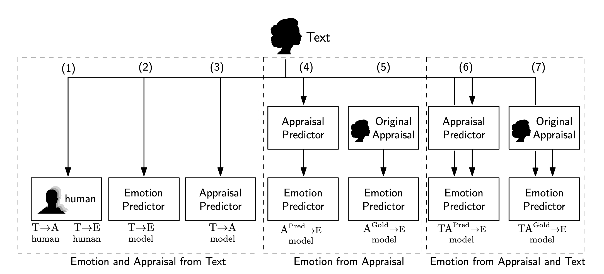

## Intro

The files in this directory belong to the paper:

[Dimensional Modeling of Emotions in Text with Appraisal Theories: Corpus Creation, Annotation Reliability, and Prediction.](https://doi.org/10.1162/coli_a_00461)

by Enrica Troiano, Laura Oberländer and Roman Klinger


## Content

This repository contains the code to reproduce and use our modeling
experiments. In the following figure coming from our paper (as Figure 10) you can see our
main experimental framework. 

- a box
in the depiction corresponds to a model (or a group of models for the case of the human evaluation).
- the head indicates data that directly stems from the
generator of a textual instance.
- the lines correspond to the flow of information used
by the box connected with an arrowhead.

The left-most model (1) represents the classification performance of the validators (readers) of crowd-enVENT. This shows how well people performed in the task undertaken by our computational models (2) to (7).

Each _experiment_ or _group of experiments_ is placed in a subdirectory of the repository. Each subdirectory usually contains the following files and folders:

- `Makefile`: A Makefile to reproduce the work
- `scripts`: Python code
- `sources`: a symlink to the toplevel sources folder, in which you need to place our corpus
- `workdata`: initially empty, this is where the experiment will store
  intermediary output files
- `outputs`: final output files (e.g. predictions, tables, etc.) of the experiments
  - `predictions`: Predictions produced by the original models
  - `plots`, `tables`
- `README.md`: specific information on how to run this experiment
- `requirements.txt`: Python dependencies

## Data

1. Set up a virtual environment:
    - `python3 -m venv venv`
    - `source venv/bin/activate`
    - `pip install -r requirements.txt`
2. Download and prepare our corpus by calling `make` in the top-level folder.

## Emotion and appraisals from text

#### Emotion labels:
 ["joy", "sadness", "surprise", "anger", "fear", "disgust", "relief", "guilt", "shame", "trust", "pride", "boredom", "no-emotion"]

#### Appraisal variables:
["suddenness", "familiarity", "predict_event", "pleasantness", "unpleasantness", "goal_relevance", "chance_responsblt" "self_responsblt", "other_responsblt", "predict_conseq", "goal_support", "urgency", "self_control", "other_control", "chance_control", "accept_conseq", "standards", "social_norms", "attention", "not_consider", "effort"]

### Experiment (1) - Human evaluation for emotion and appraisal classification from text

#### Steps
1. `cd human_evaluation`
2. read the corresponding `README` and the `Makefile`


### Experiment (2) - Emotion prediction from text
### Experiment (3) - Appraisal prediction from text

#### Steps for experiments (2) and (3):
##### [A] Allennlp version:

1. `cd emotions-and-appraisals-from-text`
2. read the corresponding `README` and the `Makefile`
3. edit the `schedule.sh` and the `evaluate.sh` to include the `classification` and `regression` settings.

##### [B] Jiant version:
1. `cd emotions-and-appraisals-from-text-jiant`
2. read the corresponding `README` and the `Makefile`.

## Emotion from appraisal values

### Experiment (4) - Emotion prediction from predicted appraisal values

### Experiment (5) - Emotion prediction from annotated appraisal values

#### Steps for experiments (4) and (5)

1. `cd emotion-from-appraisal-values`
2. read the `README` and follow the instructions there.

## Emotion from text and appraisal values

### Experiment (6) - Emotion prediction from predicted appraisal values and text

### Experiment (7) - Emotion prediction from annotated appraisal values and text

#### Steps for experiments (6) and (7)

1. `cd emotions-and-appraisals-from-text`
2. read the corresponding `README` and the `Makefile`.
3. edit the `schedule.sh` and the `evaluate.sh` script to include only the `combined` setting.

## Pretrained models and where to download them from

All models have been trained on our corpus **[crowd-enVENT]((https://www.romanklinger.de/data-sets/crowd-enVent2022.zip) )**.

| Variable | Description | URL |
| --- | --- | --- |
|  emotion  | emotion classifier based on text | [to be added here]() |
| emotion | emotion classifier based on text and **appraisal values** | [to be added here]() |
|  appraisals  | appraisal classifiers based on text | [to be added here]() |
|  appraisals  | appraisal regressors based on text | [to be added here]() |

## Citation

Please cite this paper as:

```
@article{Troiano2023,
  author = {Enrica Troiano and Laura Oberl\"ander and Roman Klinger},
  title = {Dimensional Modeling of Emotions in Text with
                  Appraisal Theories: Corpus Creation, Annotation
                  Reliability, and Prediction},
  journal = {Computational Linguistics},
  number = 1,
  volume = 49,
  month = mar,
  year = 2023,
  address = {Cambridge, MA},
  publisher = {MIT Press},
  doi = {10.1162/coli_a_00461},
  url = {https://doi.org/10.1162/coli_a_00461},
  internaltype = {journal}
}
```

## Contact

For any questions regarding the paper don't hesitate contacting us at:

- enrica.troiano@ims.uni-stuttgart.de
- laura.oberlaender@ims.uni-stuttgart.de
- roman.klinger@ims.uni-stuttgart.de

Do you have a question regarding the contents of this repository? Please create
an issue and we will reach out as soon as possible.
